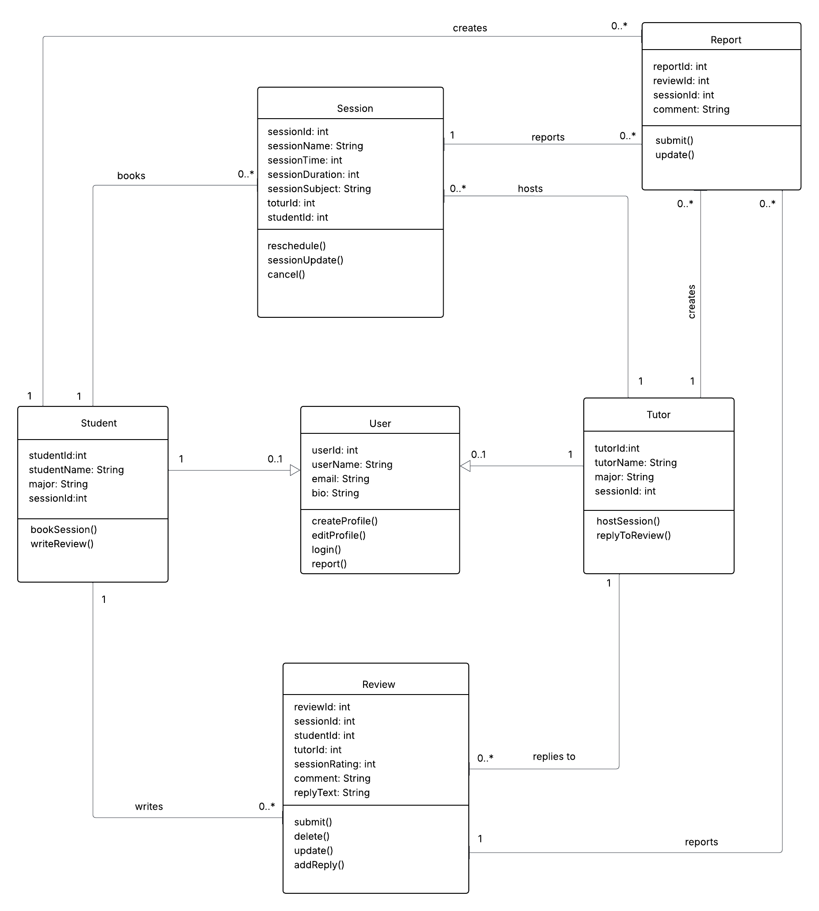

# SpartanStudy Backend API Documentation

**Version:** 1.0  
**Last Updated:** March 2026  
**Base URL:** `http://localhost:8080`

---

## Table of Contents

1. UML Diagram
2. Overview  
3. User Roles  
4. System Architecture  
5. Core Entities  
6. API Endpoints 
7. Use Case Mapping 

---
## 1. UML Diagram



## 2. Overview

The SpartanStudy Backend API provides a RESTful interface for managing a tutoring platform where students can:

- Create and manage profiles  
- Browse tutoring services (sessions)  
- Subscribe to services  
- Write reviews  

The backend is built using:

- Spring Boot  
- PostgreSQL (Neon Database)  
- JPA/Hibernate  

---

## 3. User Roles

| Role | Description | Responsibilities |
|------|------------|----------------|
| **Student** | User of the platform | Register, update profile, subscribe, review |
| **Tutor** | Host tutoring sessions | Reply to reviews, update profile, report |

---

## 4. System Architecture

Client → Controller → Service → Repository → Database

- **Controller Layer** → Handles HTTP requests  
- **Service Layer** → Contains business logic  
- **Repository Layer** → Database operations  
- **Entity Layer** → Data models  

---

## 5. Core Entities

### Student
```json
{
  "id": 1,
  "name": "Muhammad",
  "email": "m@test.com",
  "major": "Computer Science"
}

### Service
```json
{
  "id": 1,
  "name": "Math Tutoring",
  "description": "Calculus help"
}

### Review
```json
{
  "id": 1,
  "studentId": 1,
  "serviceId": 1,
  "rating": 5,
  "comment": "Great session"
}

---
## 6. API Endpoints
Student Management:

Create Student
Endpoint: POST /students
Description: Create a new student

POST /students
Content-Type: application/json

{
  "name": "Muhammad",
  "email": "m@test.com",
  "major": "CS"
}

Response:
{
  "id": 1,
  "name": "Muhammad",
  "email": "m@test.com",
  "major": "CS"
}
Status Code: 201 Created

Update Student
Endpoint: PUT /students/{id}
Description: Update student profile
PUT /students/1
{
  "name": "Muhammad Updated",
  "major": "Software Engineering"
}
Status Code: 200 OK
Service (Session) Management
Get All Services
Endpoint: GET /students/services
Description: Retrieve all available services
GET /students/services
Response:
[
  {
    "id": 1,
    "name": "Math Tutoring"
  },
  {
    "id": 2,
    "name": "Physics Help"
  }
]
Status Code: 200 OK
Subscription Management
Subscribe to Service
Endpoint: POST /students/{studentId}/subscribe/{serviceId}
Description: Subscribe a student to a service
POST /students/1/subscribe/2
Response:
{
  "message": "Subscription successful"
}
Status Code: 200 OK
Review Management
Create Review
Endpoint: POST /students/{studentId}/review/{serviceId}
Description: Create a review for a service
POST /students/1/review/2
Content-Type: application/json
{
  "rating": 5,
  "comment": "Amazing tutor!"
}
Response:
{
  "id": 1,
  "studentId": 1,
  "serviceId": 2,
  "rating": 5,
  "comment": "Amazing tutor!"
}
Status Code: 201 Created

----
## 7. Use Case Mapping

The API endpoints support the following system use cases:

---

### Student Use Cases

| Use Case | Description | Endpoint |
|----------|------------|----------|
| **US-STU-001** | Register student | `POST /students` |
| **US-STU-002** | Update student profile | `PUT /students/{id}` |
| **US-STU-003** | View available services | `GET /students/services` |
| **US-STU-004** | Subscribe to a service | `POST /students/{studentId}/subscribe/{serviceId}` |
| **US-STU-005** | Write a review | `POST /students/{studentId}/review/{serviceId}` |

---

### System Use Cases

| Use Case | Description | Endpoint |
|----------|------------|----------|
| **SYS-001** | Retrieve all services | `GET /students/services` |
| **SYS-002** | Link student to service (subscription) | `POST /students/{studentId}/subscribe/{serviceId}` |
| **SYS-003** | Store review data | `POST /students/{studentId}/review/{serviceId}` |


----
